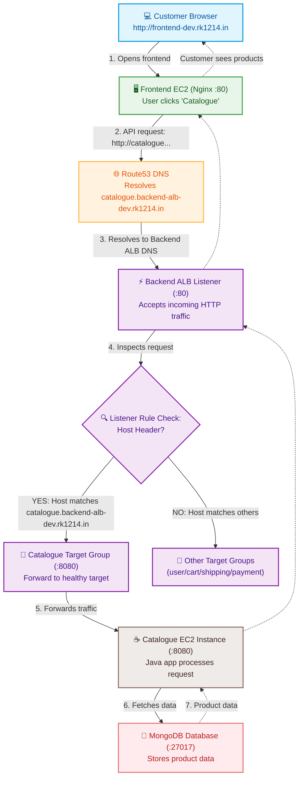

# Roboshop Infrastructure - Detailed Folder Breakdown

This document provides an elaborated explanation of each folder and its role within the Roboshop Terraform infrastructure located in `/home/ruthvekh/ruthvik/gitrepos/terraform/ec2/roboshop-dev-infra`.

---

## How to Access RoboShop

Depending on which stages of the infrastructure you have deployed, here is how you can access the environment:

### A. Web Application (Public Access)
*   **Via Frontend ALB Wildcard (Available right after `80-frontend-alb` & `90-components`):**
    *   **URL:** [https://frontend.frontend-alb-roboshop-dev.rk1214.in](https://frontend.frontend-alb-roboshop-dev.rk1214.in)
*   **Via CloudFront CDN (Available after applying `91-cdn`):**
    *   **URL:** [https://roboshop-dev.rk1214.in](https://roboshop-dev.rk1214.in)
    *   **Direct Frontend URL:** [https://frontend-dev.rk1214.in](https://frontend-dev.rk1214.in)

### B. Internal Microservices (VPC Internal Backend ALB Routing)
*   Wildcard route mapping is done via: `*.backend-alb-dev.rk1214.in`
*   *Examples:*
    *   **Catalogue:** `catalogue.backend-alb-dev.rk1214.in`
    *   **User:** `user.backend-alb-dev.rk1214.in`
    *   **Cart:** `cart.backend-alb-dev.rk1214.in`

### C. VPN & Secure Internal Database Access
*   **OpenVPN Web Portal:** `https://<VPN-Server-Public-IP>:943/`
*   **Admin Credentials:**
    *   **Username:** `openvpn`
    *   **Password:** `Openvpn@123` (configured via `vpn.sh`)

### D. Jump Server (Bastion Host)
*   **Host Name:** `RoboShopDevBastion` (deployed in the public subnet; can be used to SSH into private instances).

---

## 1. `00-vpc` (Virtual Private Cloud)
This folder is the foundational layer. It sets up the underlying network where all other resources will be placed.

*   **What it does:** It provisions the AWS Virtual Private Cloud (VPC) network.
*   **Module usage:** It utilizes a custom local module `../../terraform-aws-vpc` rather than creating raw resources, ensuring a standardized network layout across potential multiple environments.
*   **Subnet Architecture:** It creates three specific tiers of subnets:
    *   **Public Subnets:** For internet-facing resources like the Bastion host and the Frontend.
    *   **Private Subnets:** For backend application servers (Catalogue, Cart, User, Shipping, Payment) that should not be directly accessible from the outside world. **Note:** All instances deployed in these private subnets will securely access the internet for outbound requests (like downloading software packages or updates) using a **NAT Gateway** placed in the public subnet.
    *   **Database Subnets:** For the data persistence layer (MongoDB, Redis, MySQL, RabbitMQ). Similar to private subnets, any necessary outbound internet traffic from these databases routes through the NAT Gateway.
*   **State Management (`parameter.tf`):** Instead of relying solely on Terraform state outputs, it exports the newly created `vpc_id`, `public_subnet_ids`, `private_subnet_ids`, and `database_subnet_ids` directly into **AWS Systems Manager (SSM) Parameter Store**. This allows subsequent layers (like databases and apps) to simply look up the network details dynamically without needing to pass them as hardcoded variables.

---

## 2. `10-sg` (Security Groups)
This folder manages the "firewalls" for the instances but does *not* set the rules yet.

*   **What it does:** It creates the empty AWS Security Groups (SGs) for every single component in the architecture.
*   **Implementation (`main.tf`):** It loops (`for_each`) over a predefined list of SG names (e.g., `mongodb`, `redis`, `catalogue`, `frontend`, `bastion`) and calls a local module `../../terraform-aws-sg` to create them.
*   **State Management (`parameters.tf`):** Similar to the VPC folder, it takes the newly created Security Group IDs and exports them to the AWS SSM Parameter Store (e.g., `/{project}/{environment}/mongodb_sg_id`). This decouple the creation of SGs from their usage, avoiding circular dependencies.

---

## 3. `20-sg-rules` (Security Group Rules)
This folder defines the intricate web of permitted traffic flow between the Security Groups created in the previous step.

*   **What it does:** It adds `ingress` (incoming) rules to the Security Groups.
*   **Data Fetching (`data.tf` & `locals.tf`):** It fetches the Security Group IDs back out of the SSM Parameter Store that were written in `10-sg`.
*   **Traffic Flow Rules (`main.tf`):** It explicitly defines which component can talk to which component, implementing the principle of least privilege. Examples include:
    *   **Bastion Access:** The Bastion SG allows port 22 (SSH) from the administrator's IP. All other SGs (databases, apps) allow port 22 specifically *from* the Bastion SG.
    *   **Application to Database:** The MongoDB SG allows port 27017 from the Catalogue and User SGs. The MySQL SG allows port 3306 from the Shipping SG. The RabbitMQ SG allows port 5672 from the Payment SG.
    *   **Public Access:** The Frontend SG allows port 80 (HTTP) from anywhere (`0.0.0.0/0`).

---

## 4. `30-bastion` (Bastion Host)
This folder provisions the administrative entry point into the private network.

*   **What it does:** Creates an EC2 instance in the *public* subnet to serve as a jump host.
*   **IAM Role Management (`main.tf`):** Because Terraform and Ansible will be run *from* this bastion host to manage the rest of the infrastructure, it attaches a very powerful IAM Role to the instance. This role includes permissions like `AmazonEC2FullAccess`, `AmazonRoute53FullAccess`, `AmazonS3FullAccess`, `AmazonSSMFullAccess`, and `IAMFullAccess`.
*   **Bootstrapping (`bastion.sh`):** It uses `user_data` to automatically install required tools like `terraform` and `ansible` onto the bastion host right when it boots up.

---

## 5. `40-databases` (Databases & Applications)
Despite the name, this folder actually provisions *both* the databases and the backend application instances, handling their entire lifecycle.

*   **What it does:** Provisions the EC2 instances for MongoDB, Redis, MySQL, RabbitMQ, Catalogue, Cart, User, Shipping, Payment, and Frontend.
*   **Placement:** It automatically assigns them to their correct subnets (Database subnets for DBs, Private subnets for Apps, Public subnet for Frontend) and attaches the correct Security Groups by looking up the SSM parameters.
*   **Automated Configuration (Ansible Bootstrap):** Instead of just creating empty servers, it uses Terraform `terraform_data` resources combined with a `remote-exec` provisioner. 
    *   Once an instance spins up, Terraform SSHs into it (using the `ec2-user` and password).
    *   It copies over a `bootstrap.sh` script.
    *   It executes the script, which installs Ansible locally on the new instance, pulls down an Ansible playbook repository (`roboshop-ansible-roles-tf`), and runs the playbook to configure that specific component automatically.
*   **Dependency Management (`depends_on`):** To ensure Ansible configuration succeeds, it enforces strict creation orders. For example, the `catalogue` application will not begin its automated configuration until *after* the `mongodb` database has fully finished its setup.
*   **DNS Setup (`r53.tf`):** It creates internal Route53 `A` records (e.g., `mongodb-dev.rk1214.in`) pointing to the private IPs of the newly created instances, allowing applications to find their databases by name rather than hardcoded IP addresses.
*   **Secrets Management:** It specifically handles generating and storing the MySQL root password as a SecureString in the SSM Parameter Store and attaching an IAM role to the MySQL instance so Ansible can read it during configuration.

---

## 6. `50-backcend-alb` (Backend Application Load Balancer)
This folder provisions the internal Application Load Balancer (ALB) that manages backend application traffic inside the private subnets.

*   **What it does:** It sets up a private, high-availability Application Load Balancer to route requests dynamically to various backend services.
*   **Internal Scope (`internal = true`):** It is designated as an internal load balancer. It does not have public IP addresses and is only accessible from within the VPC network (e.g., from the Frontend or Bastion).
*   **Placement:** It is deployed across the private subnets for multi-AZ high availability.
*   **Security:** It associates the dedicated backend ALB security group (`local.backend_alb_sg_id`) to control who can send requests to it.
*   **Listeners & Default Rules (`main.tf`):**
    *   Creates an HTTP listener on port 80.
    *   Configures a **fixed-response** default action returning a simple HTML message (`"<h1> Backend ALB is working fine</h1>"` with status `200`). This acts as a fallback/health verification. If a request is sent to the ALB that does not match any service-specific listener rules, the ALB safely returns this 200 OK response instead of timing out or throwing 5xx errors.
*   **DNS & Alias Record Setup (`main.tf`):**
    *   Creates a wildcard Route 53 `A` record alias (`*.backend-alb-dev.rk1214.in`) pointing directly to the ALB's DNS name.
    *   This wildcard mapping allows all backend microservices (e.g., `catalogue`, `user`, `cart`, `shipping`, `payment`) to share the same ALB using host-based routing.
*   **State Management & SSM Integration (`parameters.tf`):**
    *   It exports the backend ALB HTTP Listener ARN to the AWS SSM Parameter Store (`/roboshop/dev/backend-alb_listener_arn`).
    *   Subsequent application components (like `60-catalogue`) read this parameter to attach their respective target groups and listener rules to the ALB dynamically, keeping the ALB definition decoupled from individual service lifecycle configurations.

---

## 7. `60-catalogue` (Catalogue Component & AMI Baking Pattern)
This folder provisions the EC2 instance for the `catalogue` backend service and bakes it into a custom Amazon Machine Image (AMI).

*   **Subnet List vs. String Alignment:** 
    *   To prevent type/index errors, `locals.tf` fetches the comma-separated private subnets as a clean list using:
        ```terraform
        private_subnet_ids = split(",", data.aws_ssm_parameter.private_subnet_ids.value)
        ```
    *   In `main.tf`, the first subnet is safely accessed using:
        ```terraform
        subnet_id = local.private_subnet_ids[0]
        ```
*   **Dynamic Data Sources (`data.tf`):** A dedicated data configuration resolves parameters dynamically, including the base `joindevops` AMI (`Redhat-9-DevOps-Practice`), `private_subnet_ids`, and the `catalogue_sg_id` from SSM Parameter Store.
*   **Automated Bootstrap and Baking Lifecycle:**
    1.  **Creation:** An EC2 instance `aws_instance.catalogue` is launched.
    2.  **Configuration:** The `terraform_data.catalogue` resource triggers, copies `bootstrap.sh`, and runs Ansible locally on the instance to configure it fully as the catalogue service.
    3.  **State Management (Stop):** The `aws_ec2_instance_state.catalogue` resource is defined to automatically change the instance state to `stopped` once the bootstrap process is successfully completed.
    4.  **Baking:** The `aws_ami_from_instance.catalogue` resource takes the stopped, fully bootstrapped instance and bakes it into a custom AMI named `${var.project}-${var.environment}-catalogue`.
    5.  **Benefit:** This pre-baked AMI can be used for zero-delay auto-scaling and immutable deployments, eliminating the need to run Ansible playbooks from scratch during scale-out events.
*   **Scale-Up Policy & Warmup Timing (`estimated_instance_warmup`):**
    *   In the Target Tracking Scaling Policy (`aws_autoscaling_policy.catalogue_scale_up`), we explicitly configure `estimated_instance_warmup = 120` (2 minutes).
    *   **What it does:** It tells AWS Auto Scaling how long to wait after launching a new EC2 instance before including its CPU utilization/metrics in the CloudWatch average.
    *   **Why it's critical**: It takes time for an EC2 instance to spin up, complete its initialization scripts, and load the Java app. If we didn't specify a warmup period, CloudWatch would see the newly launched instance as having 0% load initially, or it would still see high average CPU and trigger *even more* instances in rapid succession (scaling thrashing). A 120-second warmup gives the instance room to boot and take on traffic before another scaling action is evaluated.

---

## 8. `70-acm` (AWS Certificate Manager & Automated DNS Validation)
This folder manages the SSL/TLS certificate layer to enable secure HTTPS communication for public and private subdomains.

*   **What it does:** It requests, validates, and manages a public wildcard SSL/TLS certificate through AWS Certificate Manager (ACM) and Route 53 DNS.
*   **Wildcard Certificate Request (`aws_acm_certificate.roboshop`):**
    *   Provisions a wildcard certificate for `*.${var.domain_name}` (e.g., `*.rk1214.in`).
    *   Uses `validation_method = "DNS"`. DNS validation is chosen over email validation because it is fully programmatic, does not require human intervention, and allows auto-renewal of certificates without further setup.
*   **Automated DNS Challenge Validation (`aws_route53_record.roboshop`):**
    *   AWS ACM requires DNS verification to prove ownership of the domain before issuing the certificate. ACM provides specific challenge records via the `domain_validation_options` attribute.
    *   Terraform dynamically iterates over these domain validation records using a `for_each` loop.
    *   It automatically creates corresponding validation CNAME records in the Route 53 hosted zone to complete the DNS challenge challenge cleanly.
*   **Validation Gatekeeper (`aws_acm_certificate_validation.roboshop`):**
    *   This resource represents the successful completion of the validation process.
    *   It references the certificate's ARN and wait for the validation DNS records' FQDNs to resolve and propagate.
    *   It acts as a blocking, synchronous gatekeeper in Terraform's dependency tree, guaranteeing that downstream resources (such as secure load balancers or CloudFront distributions) do not try to use the certificate before AWS ACM has officially verified and issued it.
*   **Lifecycle Policy (`create_before_destroy = true`):**
    *   Configures `create_before_destroy = true` inside the certificate's lifecycle block.
    *   This is highly critical because an ACM certificate cannot be deleted or replaced while it is actively bound to an active resource (like an HTTPS listener). By instructing Terraform to create and validate the new certificate *before* attempting to delete the old one, we ensure zero-downtime certificate rotation.

---

## 9. `80-frontend-alb` (Frontend Application Load Balancer)
This folder provisions the public-facing Application Load Balancer (ALB) that manages secure traffic from the internet to the frontend instances.

*   **What it does:** It sets up an internet-facing, high-availability Application Load Balancer to route client traffic securely to the frontend application layer.
*   **External Scope (`internal = false`):** It is designated as an internet-facing load balancer. It has a public DNS name and public IP addresses to accept connections from the outside world.
*   **Placement:** It is deployed across the public subnets to allow direct internet ingress.
*   **Security:** It associates the dedicated frontend ALB security group (`local.frontend_alb_sg_id`) to control permitted traffic.
*   **Listeners & Secure Rules (`main.tf`):**
    *   Creates an HTTPS listener on port 443.
    *   References the SSL/TLS certificate from the SSM parameter (`local.acm_arn`) to enable secure HTTPS termination.
    *   Configures a **fixed-response** default action returning a simple HTML message (`"<h1> Frontend ALB is working fine</h1>"` with status `200`) as fallback and health confirmation.
*   **DNS & Alias Record Setup (`main.tf`):**
    *   Creates a wildcard Route 53 `A` record alias (`*.frontend-alb-dev.rk1214.in`) pointing directly to the ALB's DNS name.
    *   This allows clean subdomains to point securely to our frontend application.
*   **State Management & SSM Integration (`parameters.tf`):**
    *   It exports the frontend ALB HTTPS Listener ARN to the AWS SSM Parameter Store (`/roboshop/dev/frontend-alb_listener_arn`) for future use.

---

## 10. `90-components` (Microservices Application Components)
This folder provisions and configures the actual running microservices for the Roboshop application (Catalogue, Cart, User, Shipping, Payment, and Frontend) in an automated, dry-loop fashion.

*   **What it does:** It loops over a map of components and configures each microservice using a dynamic module loop.
*   **Reusable Module Integration:** It delegates resource creation to the `terraform-roboshop-component` Git module (`source = "git::https://github.com/ruthvikk1214/terraform-roboshop-component.git?ref=main"`).
*   **Listener Rule Priorities:** In order to prevent traffic routing collisions on the ALB, it explicitly configures distinct priorities for each component:
    *   `frontend`: rule priority `105`
    *   `catalogue`: rule priority `110`
    *   `cart`: rule priority `111` (updated to move away from potential slot conflicts)
    *   `payment`: rule priority `112`
    *   `user`: rule priority `113`
    *   `shipping`: rule priority `114`

---

## 11. `91-cdn` (CloudFront Content Delivery Network)
This folder configures the edge caching layer to accelerate frontend delivery and secure user access.

*   **What it does:** It sets up an Amazon CloudFront CDN distribution in front of the Frontend Load Balancer.
*   **Origins & Viewer Policy:** Points directly to the HTTPS Frontend ALB endpoint, enforcing `https-only` with `TLSv1.2` or `TLSv1.1`.
*   **SSL/TLS Certificate:** Binds the ACM SSL/TLS wildcard certificate to secure HTTPS delivery at the edge for custom domain aliases like `${var.project}-${var.environment}.${var.domain_name}` (e.g. `roboshop-dev.rk1214.in`).
*   **Caching Strategy:**
    *   **Dynamic / Default Cache:** Configured with `cachingDisabled` to prevent caching dynamic APIs or state-dependent responses.
    *   **Static Assets Cache:** Ordered behaviors for paths `/media/*` and `/images/*` are configured with `cachingOptimized` to cache static content at CloudFront edge locations, maximizing performance and reducing load on frontend EC2 instances.
*   **DNS Integration:** Creates a Route 53 `A` record alias mapping the user-facing domain (e.g., `roboshop-dev.rk1214.in`) directly to the CloudFront distribution.

---

## 12. Load Balancer Concepts


### How Does a Load Balancer Work?
A Load Balancer acts as a "traffic cop" sitting in front of your servers and routing client requests across all servers capable of fulfilling those requests in a manner that maximizes speed and capacity utilization. 
*   **Distribution:** It distributes incoming network traffic across multiple targets (like EC2 instances, containers, or IP addresses).
*   **Health Checks:** It continuously monitors the health of its registered targets. If a target becomes unhealthy, the load balancer stops routing traffic to it and redirects it to the remaining healthy targets.
*   **Scaling:** It helps applications scale by easily allowing the addition or removal of backend servers without changing the endpoint that the clients use.
*   **Session Persistence:** (Optional) It can tie a user's session to a specific target to ensure all their requests go to the same server (sticky sessions).

### Sequence of Events When a Request Hits an Application Load Balancer (ALB)
Before a request reaches the backend servers, a specific sequence of events occurs:

1.  **DNS Resolution:**
    *   The user types a URL (e.g., `www.roboshop.com`) into their browser.
    *   The browser queries a DNS server (like Amazon Route 53) to resolve the domain name to an IP address.
    *   Route 53 returns the IP addresses of the ALB nodes (since ALBs are dynamically scaled by AWS, Route 53 returns a dynamic list of IPs).
2.  **TCP Handshake & TLS/SSL Termination:**
    *   The client establishes a TCP connection with one of the ALB nodes using the resolved IP.
    *   If using HTTPS, the ALB performs the TLS/SSL handshake. The ALB decrypts the request, offloading the CPU-intensive decryption process from the backend servers.
3.  **ALB Request Evaluation (Listener Rules):**
    *   The ALB evaluates the incoming HTTP/HTTPS request against its configured **Listeners**.
    *   It checks the **Listener Rules** based on the request's content, such as the Host header (e.g., `api.roboshop.com`) or the path (e.g., `/api/catalogue`).
4.  **Target Group Routing:**
    *   Based on the matching rule, the ALB determines which **Target Group** should handle the request.
    *   The Target Group contains a list of backend resources (e.g., EC2 instances running the catalogue service).
5.  **Target Selection:**
    *   The ALB selects a healthy target from the Target Group using a routing algorithm (typically Round Robin for ALBs).
6.  **Backend Connection:**
    *   The ALB opens a new TCP connection (or reuses an existing one) to the selected backend instance and forwards the HTTP request to it.
7.  **Response Handling:**
    *   The backend server processes the request and sends the HTTP response back to the ALB.
    *   The ALB forwards the response back to the client over the original connection.

### Important Port Numbers in an ALB Setup
When configuring an Application Load Balancer, you need to manage two sets of ports:

1. **Listener Ports (Front-End):**
   * These are the ports the ALB listens on for incoming traffic from clients (users or other services).
   * **Port 80 (HTTP):** Standard unencrypted web traffic.
   * **Port 443 (HTTPS):** Encrypted secure web traffic (requires an SSL/TLS certificate).

2. **Target Group Ports (Back-End):**
   * This is the port your actual application is running on inside the EC2 instances. The ALB forwards traffic to this port.
   * *Examples in Roboshop:*
     * **Port 80:** Used for the Nginx `frontend` service.
     * **Port 8080:** Used for the backend APIs like `catalogue`, `user`, `cart`, `shipping`, and `payment`.

3. **Health Check Ports:**
   * The ALB periodically pings a specific path (e.g., `/health`) on your instances to ensure they are alive. This usually defaults to the **Target Group Port** (e.g., 80 or 8080) unless explicitly configured otherwise.

4. **Complete List of Roboshop Ports:**
   Beyond the ALB itself, the various backend components use specific ports that must be permitted in your Security Group (`20-sg-rules`) configurations:
   * **Port 22:** SSH (used by the Bastion host to connect to all other instances).
   * **Port 80:** HTTP (Frontend Nginx server and ALB listener).
   * **Port 443:** HTTPS (Secure ALB listener).
   * **Port 8080:** Backend Application APIs (Catalogue, User, Cart, Shipping, Payment).
   * **Port 3306:** MySQL database.
   * **Port 27017:** MongoDB database.
   * **Port 6379:** Redis in-memory datastore.
   * **Port 5672:** RabbitMQ message broker.

### Why Use an ALB Instead of Multiple EC2 Instances with a Domain Name?
Using an Application Load Balancer (ALB) offers significant advantages over simply having multiple EC2 instances with a DNS record pointing to them:

1.  **High Availability & Fault Tolerance:**
    *   **ALB:** It automatically detects unhealthy instances and reroutes traffic to healthy ones.
    *   **No ALB:** If one instance fails, all traffic to that instance is lost until the instance is manually fixed or replaced. There is no automatic failover mechanism.

2.  **Scalability:**
    *   **ALB:** It can automatically scale the number of its own nodes to handle traffic spikes. You can also easily add or remove backend instances behind the ALB without changing the public DNS name.
    *   **No ALB:** Adding more instances requires manually updating DNS records and potentially configuring round-robin DNS, which is less efficient and not transparent to the user.

3.  **Security:**
    *   **ALB:** It can handle SSL/TLS termination, offloading the encryption overhead from your backend servers. It also provides features like Web Application Firewall (WAF) integration.
    *   **No ALB:** You would need to install SSL certificates on every single EC2 instance and manage their lifecycle individually.

4.  **Health Monitoring:**
    *   **ALB:** Provides deep, configurable health checks. It can check specific endpoints (e.g., `/health`) to determine if the application is truly responsive.
    *   **No ALB:** You can't easily perform health checks on individual instances via a simple domain name without extra configuration.

5.  **Simplified Client Management:**
    *   **ALB:** Clients only need to know one hostname. The ALB handles the complexity of routing to the correct backend instance.
    *   **No ALB:** Clients might need to be aware of multiple IP addresses, or you would need a more complex DNS setup to handle the distribution.

### Key Concepts in Application Load Balancing (ALB)
To effectively utilize ALBs in your infrastructure, it's crucial to understand these core concepts:

1. **ALB Nodes (Dynamic Instances):**
   * Unlike EC2 instances, an ALB is not a single server. It is a managed service by AWS that runs on multiple internal instances distributed across multiple Availability Zones.
   * AWS automatically provisions, manages, and scales the number of these nodes based on incoming traffic.
   * As traffic increases, AWS automatically adds more ALB nodes; as traffic subsides, it scales them down to save costs.
   * This inherent multi-AZ distribution provides high availability by default.

2. **Target Groups:**
   * A Target Group is a logical grouping of your backend resources (e.g., EC2 instances) that the ALB will route traffic to.
   * You can define health check parameters for each target group to specify how rigorously the ALB should test the health of the instances.
   * You can route traffic to different target groups based on rules (e.g., send `/api/*` traffic to one group and `/images/*` to another).

3. **Listeners:**
   * A Listener is a process that checks for connection requests. It has a protocol (e.g., HTTP, HTTPS) and a port (e.g., 80, 443).
   * The Listener is what clients connect to.
   * You can have multiple listeners for the same ALB (e.g., one for HTTP and another for HTTPS).
   * **Note:** An ALB can have multiple listeners, and each listener can have multiple rules. For example, a Listener for HTTPS (port 443) could have one rule to forward `/api/*` to the API Target Group and another rule to forward `/` to the Frontend Target Group.

4. **Listener Rules:**
   * Listener Rules define how the ALB should behave when a request matches specific criteria.
   * Rules are processed in order of priority, and the first rule that matches is applied.
   * You can use conditions based on host headers, URL paths, HTTP headers, source IP addresses, and more.
   * **Default Rule:** Every listener must have a default rule that applies if no other rules match.

5. **Health Checks:**
   * These are crucial for maintaining the availability of your application.
   * The ALB periodically sends requests to a specified path (the health check endpoint) on each target.
   * If a target fails a certain number of health checks, the ALB marks it as unhealthy and stops sending traffic to it.
   * Once the instance becomes healthy again (passes the checks), the ALB automatically resumes sending traffic to it.
   * Health checks help you meet the 99.95% availability SLA for ALB usage.

### AWS ALB Request Flow (Roboshop Host-Based Routing Example)

#### 1. Host-Based Routing Flow Diagram (Mermaid)



#### 2. Text-Based Flowchart

```text
Customer Browser
     |
     | 1. Opens frontend: http://frontend-dev.rk1214.in
     v
Frontend EC2 (Nginx :80)
     |
     | 2. User clicks "Catalogue" -> Sends API request:
     |    http://catalogue.backend-alb-dev.rk1214.in/products
     v
Route53 DNS
     |
     | 3. Resolves hostname to Backend ALB DNS
     v
Backend ALB Listener (:80)
     |
     | 4. Listener accepts incoming HTTP traffic
     v
Listener Rule Check
     |
     | Host Header? catalogue.backend-alb-dev.rk1214.in
     |
     +---- YES ----> Forward to Catalogue Target Group (:8080)
     |
     +---- NO -----> Check other listener rules (user/cart/shipping/payment)
     v
Catalogue Target Group (:8080)
     |
     | 5. ALB forwards traffic to healthy target
     v
Catalogue EC2 Instance (:8080)
     |
     | 6. Java app processes request
     v
MongoDB (:27017)
     |
     | 7. Fetch product data
     v
[Response Flow: MongoDB -> Catalogue App -> ALB -> Frontend -> Customer sees products]
```

#### 3. Port Responsibility Matrix

| Port | Protocol / Service | Component Role / Context |
| :--- | :--- | :--- |
| **80** | HTTP | Public traffic (ALB / Frontend listener) |
| **8080** | Custom / HTTP | Backend application traffic (Java apps: Catalogue, User, etc.) |
| **27017** | MongoDB | Database layer for Catalogue & User |
| **6379** | Redis | In-memory key-value cache |
| **3306** | MySQL | Relational database (Shipping data) |
| **5672** | RabbitMQ | Message queue broker (Payment) |

#### 4. ALB Core Architectural Concepts

*   **Listener:** Receives incoming traffic on a specified port and protocol.
*   **Listener Rule:** Decides how to route incoming traffic based on criteria (Host headers, paths, etc.).
*   **Target Group:** The backend destination containing one or more registered, healthy servers.
*   **Health Check:** Performs automated, periodic checks to confirm that the backend app is responsive and alive.

**Example Routing Scenario:**
*   **Customer Request:** `catalogue.backend-alb-dev.rk1214.in:80`
*   **ALB Listener:** Receives traffic on port `80`.
*   **Listener Rule:** Checks conditions: `If host = catalogue.backend-alb-dev.rk1214.in`.
*   **Target Group:** Forwards request to healthy catalogue instances on backend port `8080`.

---

## 13. Terraform Git Management & Core Lifecycle Concepts

### Why We Never Push the `.terraform` Directory
The `.terraform` directory is a local working directory created by Terraform during initialization. **It must be added to `.gitignore` and never committed to Git** for several critical reasons:
1. **Massive Size**: It houses the compiled provider binaries (such as the AWS provider plugin). These binaries are extremely heavy (often hundreds of megabytes) and will quickly bloat the git repository.
2. **Platform Specificity**: The downloaded provider binaries are compiled specifically for the OS and architecture of the machine running the code (e.g., Windows x64 vs. Linux arm64). Committing them would break executions on different developer machines or CI/CD pipelines.
3. **Redundancy**: The directory contains no unique configuration code. It is designed to be easily re-generated at any moment by running `terraform init`.

---

### Understanding Core Lifecycle Commands & Files

#### 1. `terraform init`
This is the mandatory first command you run when setting up or cloning a Terraform configuration. It performs the following initialization steps:
* **Downloads Providers**: Reads your configuration (e.g., `required_providers`) and downloads the correct provider plugins from the Terraform Registry into the local `.terraform` directory.
* **Initializes the Backend**: Sets up the state storage location (local file or remote backends like AWS S3/Azure Blob/Terraform Cloud).
* **Downloads Modules**: Resolves and retrieves any local or remote module dependencies referenced in your code.

#### 2. `terraform init -reconfigure`
This option tells Terraform to ignore any cached backend configuration stored in the `.terraform` folder and force a fresh reconfiguration of the state backend.
* **When to use it**: 
  * When you are switching between different remote state backends or S3 buckets.
  * When switching AWS accounts/environments that require entirely separate state tracking.
  * When backend credentials or configuration keys change.
* **Why it's better than simple init**: Standard `terraform init` will try to migrate or copy state between backends if it sees a cached backend state. `-reconfigure` completely overrides the cache and initializes clean.

#### 3. The Dependency Lock File (`.terraform.lock.hcl`)
When you run `terraform init`, Terraform generates or updates a `.terraform.lock.hcl` file in your root folder. 
* **What it does**: It locks the exact versions of the provider plugins you initialized, along with their cryptographic hash checksums for all supported operating systems.
* **Why we DO commit it**: Unlike the `.terraform` directory, **you should always commit `.terraform.lock.hcl` to Git**. It ensures that every developer and CI/CD agent in your team downloads the *exact same provider versions* (e.g., AWS provider `v5.40.0`), preventing unexpected breaking changes or provider upgrades from breaking your deployments.

---

### Why Destroy Order Matters (Reverse Creation Order)
When tearing down multi-layered AWS environments like Roboshop, **you must destroy the folders in the exact reverse order of their creation**:
1. `70-acm` (AWS Certificate Manager & Route53 Validation)
2. `60-catalogue` (Catalogue Component & AMI Baking Pattern)
3. `50-backcend-alb` (Backend Application load balancers)
4. `40-databases` (Databases & Backend Applications)
5. `30-bastion` (Jump hosts / Bastion compute)
6. `20-sg-rules` (Security group ingress/egress rules)
7. `10-sg` (Security groups)
8. `00-vpc` (Virtual Private Cloud networks)

**Why this is mandatory**:
* **Dependency Locking**: A Security Group cannot be deleted if there is still a Security Group Rule that references it or a running instance associated with it.
* **VPC Deletion Constraints**: A VPC cannot be destroyed if it still contains active network interfaces, security groups, routing tables, subnets, or load balancers.
* Tearing down layer-by-layer backwards from top (Apps) to bottom (VPC) cleanly untangles and removes these AWS dependency linkages without triggering "DependencyViolation" or "ActiveResource" errors.

---

## 14. Troubleshooting & Lessons Learned (May 2026)

### Bug 1: SSM Parameter Resource Not Found (`70-acm` vs `80-frontend-alb` Dependency)
*   **Problem:** Attempting to apply `80-frontend-alb` failed with the error:
    ```text
    Error: reading SSM Parameter (/roboshop/dev/frontend_alb_certificate_arn): couldn't find resource
    ```
*   **Cause:** The SSM parameter for the ACM certificate ARN is created in the `70-acm` module. The `80-frontend-alb` module retrieves this parameter via a data source. Because `70-acm` had not been applied, the parameter did not exist in AWS SSM Parameter Store yet.
*   **Fix:** Navigated to `70-acm/` and successfully ran `terraform apply -auto-approve` first, creating the SSM parameter, before running the apply in `80-frontend-alb/`.

### Bug 2: HTTPS:443 Unreachable on Frontend ALB (`20-sg-rules` SG ID Mismatch)
*   **Problem:** The frontend load balancer deployed successfully, but the AWS Console reported **"HTTPS:443 Not reachable"** with a tooltip stating that security groups did not allow traffic.
*   **Cause:** In `20-sg-rules/main.tf`, the rule `frontend_alb_internet` (allowing ingress on port 443 from `0.0.0.0/0`) incorrectly targeted `local.frontend_sg_id` (the security group for the frontend EC2 instances) instead of `local.frontend_alb_sg_id` (the security group for the ALB itself).
*   **Fix:**
    1. Added `data.aws_ssm_parameter.frontend_alb_sg_id` in `20-sg-rules/data.tf`.
    2. Exposed `frontend_alb_sg_id` in `20-sg-rules/locals.tf`.
    3. Corrected `security_group_id = local.frontend_alb_sg_id` in `20-sg-rules/main.tf`.
    4. Ran `terraform apply` in `20-sg-rules/` to apply the correct rule attachments.

### Bug 3: Hostname Verification Failed / SEC_E_WRONG_PRINCIPAL (ACM Wildcard Limitation)
*   **Problem:** Running `curl https://vre.frontend-alb-roboshop-dev.rk1214.in/` failed with SSL check error:
    ```text
    curl: (60) schannel: SNI or certificate check failed: SEC_E_WRONG_PRINCIPAL (0x80090322) - The target principal name is incorrect.
    ```
*   **Cause:** The original certificate created in `70-acm` was only for `*.rk1214.in`. A wildcard SSL certificate is strictly single-level (only matches `anything.rk1214.in`). It does NOT match a nested domain like `vre.frontend-alb-roboshop-dev.rk1214.in` (which is 3 levels deep).
*   **Fix:**
    1. Added a **Subject Alternative Name (SAN)** list to the `aws_acm_certificate.roboshop` resource in `70-acm/main.tf` to cover the deeper wildcard pattern:
       ```terraform
       subject_alternative_names = [
         "*.frontend-alb-${var.project}-${var.environment}.${var.domain_name}"
       ]
       ```
    2. Applied the change in `70-acm/` (creating a new validated ACM certificate and updating SSM).
    3. Re-applied the change in `80-frontend-alb/` to associate the new certificate with the HTTPS listener, resolving the verification error completely.

### Bug 4: ACM Request Certificate Access Denied on Bastion
*   **Problem:** Running `terraform apply` in `70-acm` from the Bastion host threw an `AccessDeniedException` when requesting ACM certificates:
    ```text
    operation error ACM: RequestCertificate: AccessDeniedException: User is not authorized to perform: acm:RequestCertificate
    ```
*   **Cause:** The granular IAM Role attached to the Bastion host (`bastion`) lacked the necessary permissions to request and validate ACM certificates.
*   **Fix:**
    1. Added the `AWSCertificateManagerFullAccess` policy attachment to the `bastion` IAM role in `30-bastion/main.tf`.
    2. Ran `terraform apply` inside `30-bastion/` to attach the policy dynamically to the existing Bastion host without needing to recreate the instance.

### Bug 5: Bastion LVM Disk Full / No Space Left on Device
*   **Problem:** Running `terraform init` or other operations on the Bastion threw errors:
    ```text
    no space left on device
    ```
*   **Cause:** While the Bastion host was provisioned with a 50GB EBS volume, the default RedHat LVM layout did not automatically expand, leaving the root partition (`/`) locked at only 6.0GB (97% full). Additionally, duplicate **150MB+** provider binaries were downloaded in every directory (`00-vpc`, `10-sg`, `90-components`, etc.).
*   **Fix:**
    1. Expanded the physical partition: `growpart /dev/nvme0n1 4`
    2. Resized the LVM Physical Volume: `pvresize /dev/nvme0n1p4`
    3. Resized the root Logical Volume: `lvextend -l +100%FREE /dev/RootVG/rootVol` (Note: case-sensitive name `rootVol`).
    4. Grew the XFS filesystem: `xfs_growfs /`
    5. Configured a **Terraform Global Plugin Cache** in `~/.terraformrc` to share a single copy of provider plugins across all folders, saving gigabytes of disk space:
       ```hcl
       plugin_cache_dir = "$HOME/.terraform.d/plugin-cache"
       ```

### Bug 6: SSM Listener ARN Parameter Name Mismatch
*   **Problem:** Applying `90-components` failed with:
    ```text
    Error: reading SSM Parameter (/roboshop/dev/backend_alb_listener_arn): couldn't find resource
    ```
*   **Cause:** The SSM parameter for backend/frontend listeners was created with hyphens in `80-frontend-alb` (`backend-alb_listener_arn`), but the component module was configured to read them with underscores (`backend_alb_listener_arn`).
*   **Fix:** Updated the parameter lookups in the component module's `data.tf` to match the actual AWS SSM parameter names (`backend-alb_listener_arn` and `frontend-alb_listener_arn`).

### Bug 7: File Provisioner bootstrap.sh Path Mismatch
*   **Problem:** Component deployment failed with:
    ```text
    stat bootstrap.sh: no such file or directory
    ```
*   **Cause:** The file provisioner inside the component module used a local path `source = "bootstrap.sh"`. Terraform evaluates provisioner file paths relative to the root execution directory (e.g. `90-components/`), where `bootstrap.sh` does not exist.
*   **Fix:** Updated the `source` path inside the module's `main.tf` to use `${path.module}/bootstrap.sh` to correctly resolve files relative to the module folder itself.

### Bug 8: Target Group & Autoscaling Group Naming Conflicts (`DuplicateTargetGroupName`)
*   **Problem:** Running `terraform apply` in `90-components` threw errors stating that resources (Target Groups, Launch Templates, etc.) already existed with the name `roboshop-dev-main`.
*   **Cause:** In the reusable component module's `main.tf`, several AWS resources were hardcoded to use `-main` as a suffix. When looping over multiple components (`cart`, `catalogue`, `frontend`) using `for_each`, they all attempted to create resources with the exact same name, causing collisions in AWS.
*   **Fix:** Replaced the hardcoded `-main` suffix with `-${var.component}` in the module's `main.tf` for AMIs, Target Groups, Launch Templates, ASGs, and Auto Scaling policies, ensuring unique names (e.g. `roboshop-dev-cart`, `roboshop-dev-catalogue`, `roboshop-dev-frontend`).

### Bug 9: Ansible playbook bootstrap.sh Argument Typo
*   **Problem:** Remote execution of `bootstrap.sh` completed with exit status 1:
    ```text
    Process exited with status 1
    ```
*   **Cause:** In the module's `remote-exec` block, the execution command was:
    ```hcl
    sudo /tmp/bootstrap.sh main ${var.component} ${var.environment}
    ```
    This passed `"main"` as the first argument (`$1`). Since `bootstrap.sh` parses `$1` as the component name and passes it directly to `ansible-playbook -e component=$component`, the playbook tried to configure a host/role called `"main"`, which does not exist.
*   **Fix:** Updated the execution command to pass the component name directly as the first argument:
    ```hcl
    sudo /tmp/bootstrap.sh ${var.component}
    ```

### Bug 10: Nginx Fails to Start with host not found in upstream (DNS Wildcard Mismatch)
*   **Problem:** Nginx on the Frontend instance failed to start with a fatal error:
    ```text
    nginx: [emerg] host not found in upstream "catalogue.backend-alb-dev.rk1214.in" in /etc/nginx/nginx.conf:50
    ```
*   **Cause:** In `50-backcend-alb/main.tf`, the wildcard Route53 alias record was created with a project prefix: `*.backend-alb-${var.project}-${var.environment}.${var.domain_name}` (resolving to `*.backend-alb-roboshop-dev.rk1214.in`). However, the Nginx reverse-proxy configuration was looking for `catalogue.backend-alb-dev.rk1214.in` (without the `roboshop-` prefix). Because the domain was unresolvable, Nginx crashed on startup.
*   **Fix:** Updated the wildcard DNS record name in `50-backcend-alb/main.tf` to `*.backend-alb-${var.environment}.${var.domain_name}`, aligning it perfectly with the Ansible playbooks.

### Bug 11: Backend ALB Host Header Separation Mismatch (Dash vs Dot)
*   **Problem:** The frontend could not route traffic to catalogue/cart microservices because of a host header mismatch.
*   **Cause:** In the component module's `locals.tf`, the ALB listener host header condition was configured as `"${var.component}-backend-alb-${var.environment}.${var.domain_name}"` (using a **dash** separator: e.g. `catalogue-backend-alb-dev`). However, the frontend Nginx reverse-proxy sends traffic using `catalogue.backend-alb-dev` (using a **dot** separator).
*   **Fix:** Changed the separator in the module's `locals.tf` `host_header` logic from a dash to a dot (`"${var.component}.backend-alb-${var.environment}.${var.domain_name}"`) to match the Nginx proxy headers.